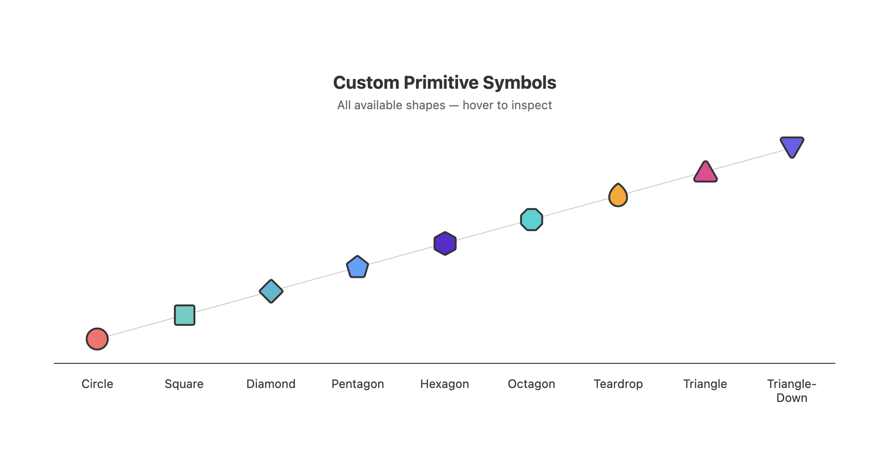
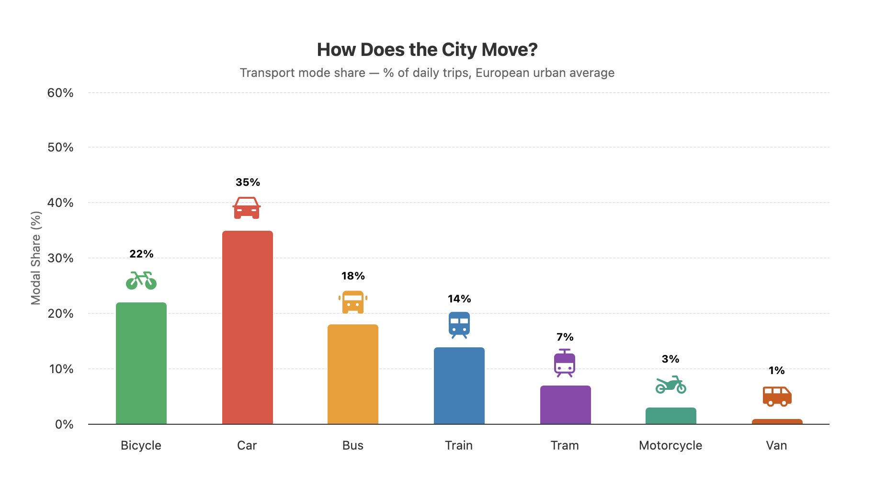
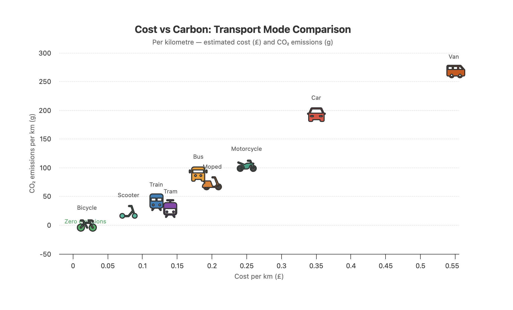
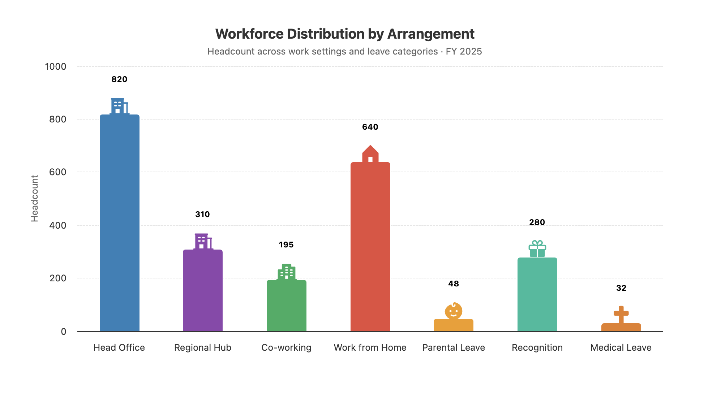

# highcharts-custom-symbols

A collection of SVG-based symbols for [Highcharts](https://www.highcharts.com), extending its built-in marker library with curated icon sets for transport, people analytics, decorative, and geometric use cases.

Symbols are generated from SVG source files via a bundled conversion script and registered directly on `Highcharts.SVGRenderer.prototype.symbols`, so they work anywhere Highcharts accepts a marker symbol string.

---

## Installation

```bash
npm install highcharts-custom-symbols
```

`highcharts` is a peer dependency — make sure it is installed in your project.

---

## Usage

Import the package once at your app's entry point. This registers all symbols globally with Highcharts.

```ts
import 'highcharts-custom-symbols';
```

Then reference any symbol by name in your chart config:

```ts
import Highcharts from 'highcharts';
import 'highcharts-custom-symbols';

Highcharts.chart('container', {
  series: [{
    type: 'scatter',
    data: [
      { x: 10, y: 5,  marker: { symbol: 'bicycle' } },
      { x: 20, y: 15, marker: { symbol: 'hexagon'  } },
      { x: 30, y: 10, marker: { symbol: 'house'    } },
    ]
  }]
});
```

You can also import individual collections if you want to keep bundle size minimal:

```ts
import 'highcharts-custom-symbols/dist/symbols/transportation';
import 'highcharts-custom-symbols/dist/symbols/custom-primitives';
```

---

## Symbol Collections

### Custom Primitives

Geometrically precise shapes that extend Highcharts' default `circle`, `square`, `diamond`, and `triangle` markers.



| Symbol | Name |
|---|---|
| `circle` | Circle |
| `square` | Square |
| `diamond` | Diamond |
| `star` | Star |
| `heart` | Heart |
| `moon` | Moon |
| `pentagon` | Pentagon |
| `hexagon` | Hexagon |
| `octagon` | Octagon |
| `teardrop` | Teardrop |
| `triangle` | Triangle |
| `triangle-down` | Triangle Down |
| `egg` | Egg |

### Transportation

Icons for transport modes — useful for urban mobility dashboards, logistics charts, and route analysis.





| Symbol | Name | Symbol | Name |
|---|---|---|---|
| `airplane` | Airplane | `airplane-tilt` | Airplane Tilt |
| `airplane-taxiing` | Airplane Taxiing | `bicycle` | Bicycle |
| `boat` | Boat | `bus` | Bus |
| `cable-car` | Cable Car | `car` | Car |
| `moped` | Moped | `moped-front` | Moped Front |
| `motorcycle` | Motorcycle | `sailboat` | Sailboat |
| `scooter` | Scooter | `train` | Train |
| `train-simple` | Train Simple | `tram` | Tram |
| `van` | Van | | |

### Decorative

Expressive icons suited to content platforms, sprint dashboards, engagement metrics, and anywhere a bit of personality helps communicate the data.

| Symbol | Name | Symbol | Name |
|---|---|---|---|
| `avocardo` | Avocado | `balloon` | Balloon |
| `bomb` | Bomb | `bone` | Bone |
| `heart` | Heart | `lightling` | Lightning |
| `moon` | Moon | `puzzle` | Puzzle |
| `star` | Star | `tag` | Tag |

### People Analytics

Building and demographic icons for HR dashboards, housing market charts, workforce distribution, and workplace data.



| Symbol | Name | Symbol | Name |
|---|---|---|---|
| `baby` | Baby | `building` | Building |
| `building-apartment` | Apartment | `building-office` | Office |
| `cross` | Cross | `gift` | Gift |
| `house` | House | | |

---

## Examples

Live examples are available in [Storybook](https://storybook.js.org). Run it locally with:

```bash
npm run storybook
```

Stories cover a range of real-world chart patterns:

- **Column chart with symbols at bar tops** — transport mode share, sprint KPI scores, workforce distribution
- **Multi-series line chart** — commute times by transport mode, subscription NPS by tier, property values by type
- **Scatter chart** — cost vs carbon per transport mode

---

## Generating Your Own Symbols

The bundled `svg-converter.js` script converts any SVG file (or directory of SVGs) into a Highcharts-compatible TypeScript symbol.

**Convert a single file:**

```bash
node svg-converter.js ./svgs/my-icon.svg ./src/symbols/my-collection/
```

**Convert an entire directory (mirrors folder structure):**

```bash
node svg-converter.js ./svgs/my-collection/ ./src/symbols/my-collection/
```

The script generates one `.ts` file per SVG and an `index.ts` barrel in each output directory. SVG path commands (`M`, `L`, `C`, `A`, etc.) are preserved and scaled to Highcharts' symbol coordinate system at render time.

**Requirements:** Node.js (LTS)

---

## Contributing

Contributions are welcome — new symbol sets, converter improvements, or additional Storybook examples. Open an issue or submit a pull request.

---

## Credits

SVG source icons are from [Phosphor Icons](https://phosphoricons.com), a flexible icon family by Tobias Fried and Helena Zhang, licensed under the [MIT License](https://github.com/phosphor-icons/core/blob/main/LICENSE).

---

## License

MIT © Alexis Hope
