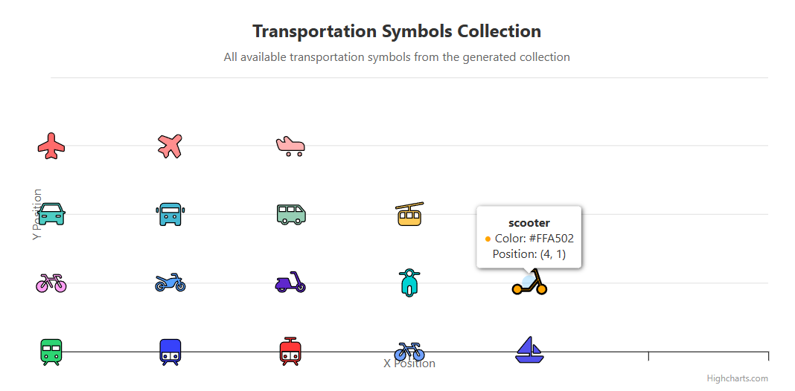

highcharts-custom-symbols
highcharts-custom-symbols is a collection of pre-defined, high-quality SVG-based symbols specifically designed for use with Highcharts. This package aims to extend Highcharts' built-in symbol library with a curated set of icons that are visually prominent and meaningful in various charting contexts.

The symbols are generated from SVG files using a custom conversion script, ensuring optimal rendering and scalability within Highcharts charts.

🚀 Features
Curated Symbol Sets: Hand-picked icons optimized for clarity and readability in charts.

Easy Integration: Symbols are provided as TypeScript/JavaScript files, ready to be imported and used with Highcharts.

Extensible: Includes a powerful svg-converter.js script, allowing you to convert your own SVG icons into Highcharts symbols.

📦 Included Symbol Collections (Current)
At present, the package includes:

Custom Primitives: A set of geometrically precise shapes (e.g., octagons, teardrops) designed to extend Highcharts' basic circle, square, diamond, and triangle symbols.

Transportation Collection: Icons representing various modes of transport, useful for logistics, urban planning, or movement-related data.

🔮 Upcoming Symbol Collections
We are actively working on expanding the library to include:

Weather Symbols: Icons for meteorological data (e.g., sun, clouds, rain, snow).

People Analytics Symbols: Inclusive and clear icons for demographic and HR-related data (e.g., gender, age groups, roles).

🛠️ Installation
(Instructions on how to install your package will go here once it's published to npm or similar.)

# Example (replace with your actual install command)
npm install highcharts-custom-symbols
# or
yarn add highcharts-custom-symbols

💡 Usage
Once installed, you can import and apply these symbols in your Highcharts configuration.

Example: Using a Custom Symbol in a Scatter Plot
import Highcharts from 'highcharts';
import { myCustomOctagonSymbol } from 'highcharts-custom-symbols/symbols/custom-primitives/octagon';
// Or import all symbols from a collection:
// import 'highcharts-custom-symbols/symbols/custom-primitives'; // This will import all symbols from the primitives collection

// Register the symbol with Highcharts (if not imported via index.ts which does it automatically)
// Highcharts.SVGRenderer.prototype.symbols['octagon'] = myCustomOctagonSymbol;

Highcharts.chart('container', {
    series: [{
        type: 'scatter',
        data: [
            { x: 10, y: 5, marker: { symbol: 'octagon' } },
            { x: 20, y: 15, marker: { symbol: 'circle' } }
        ]
    }]
});

Note: When you import from an index.ts file within a symbol collection (e.g., import 'highcharts-custom-symbols/symbols/custom-primitives';), the symbols are automatically registered with Highcharts.SVGRenderer.prototype.symbols. You only need to manually register if you're importing individual symbol files directly.

⚙️ Generating Your Own Symbols
The svg-converter.js script included in this project allows you to convert any SVG file into a Highcharts-compatible symbol.

Prerequisites
Node.js (LTS recommended)

How to Use the Converter
Clone the repository:

git clone [https://github.com/your-username/highcharts-custom-symbols.git](https://github.com/your-username/highcharts-custom-symbols.git)
cd highcharts-custom-symbols

Run the script:

Convert a single SVG file:

node svg-converter.js path/to/your/icon.svg path/to/output/directory/
# Example:
# node svg-converter.js ./src/svgs/my-icons/star.svg ./symbols/my-icons/

Convert all SVGs in a directory (and its subdirectories):

node svg-converter.js path/to/your/svgs/folder/ path/to/output/directory/
# Example: This will mirror the folder structure from src/svgs/material to symbols/material
# node svg-converter.js ./src/svgs/material/ ./symbols/material/
# Example: This will process all svgs and subdirectories from src/svgs to symbols/
# node svg-converter.js ./src/svgs/ ./symbols/

The script will automatically create output folders and an index.ts file within each folder, importing and re-exporting the generated symbols.

🤝 Contributing
We welcome contributions! If you have ideas for new symbol sets, improvements to existing ones, or enhancements to the converter script, please feel free to open an issue or submit a pull request.

📜 Credits & Licensing
This project utilizes and converts open-source SVG icons. We are committed to crediting the original creators and respecting their licenses.

[Icon Pack Name 1]: Sourced from [Link to original source, e.g., Material Design Icons]. Licensed under [License Type, e.g., Apache 2.0].

[Icon Pack Name 2]: Sourced from [Link to original source, e.g., Phosphor Icons]. Licensed under [License Type, e.g., MIT License].

(Add more entries as you include more icon packs)

The highcharts-custom-symbols project itself is licensed under the [Your License, e.g., MIT License].